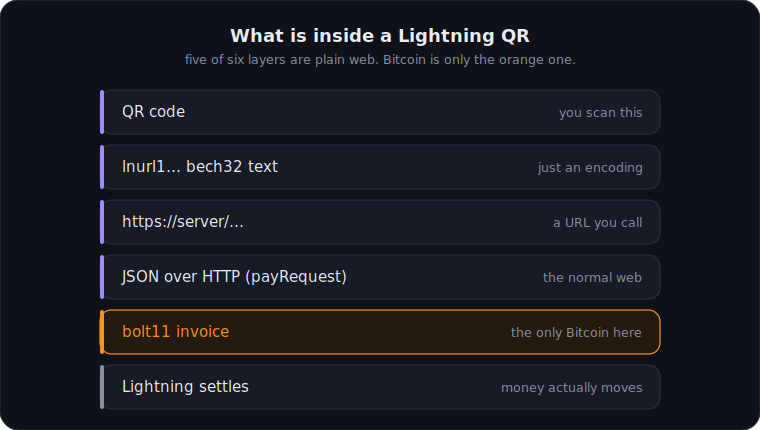
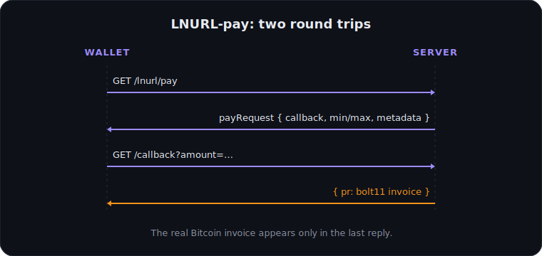

# The core principle

This is the heart of LNURL, and the part to get before anything else. It is two ideas.

<figure class="diagram">

<figcaption>Five of six layers are plain web. Only the bolt11 invoice is Bitcoin.</figcaption>
</figure>

## A wrapped link

An LNURL is ultimately just an **HTTPS URL**, packed in a special encoding (bech32, the same family
as some Bitcoin addresses). The result looks like this:

```
LNURL1DP68GURN8GHJ7UM9WFMXJCM99E3K7MF0V9CXJ0M385EKVCENXC6R2...
```

Decode it and out comes an ordinary URL:

```
https://service.com/api?q=3fc3645b439ce8e7f2553a69e5267081...
```

Why the wrapper? So it fits cleanly in a QR code (in uppercase, bech32 is compact in the QR
alphanumeric mode) and can be passed around as a single copyable string.

> The bech32 shell has no deeper meaning beyond "make it transportable". There is even a more modern
> alternative that drops it entirely (LUD-17, see [The four sub-protocols](./04-subprotocols.md)).

## The two-step flow

Almost every LNURL interaction follows the same pattern:

1. The wallet decodes the LNURL and gets the real URL.
2. The wallet makes a `GET` request to that URL.
3. The server answers with JSON. It contains a field named `tag` that says what kind of interaction
   this is: `payRequest`, `withdrawRequest`, `login`, or `channelRequest`.
4. Depending on the `tag`, the wallet makes a second request to a `callback` URL to finish the action.

That is it. Everything else is a variation of this "ask what is possible, then do it" dance.

<figure class="diagram">

<figcaption>LNURL-pay in two round trips. The Bitcoin invoice appears only in the last reply.</figcaption>
</figure>

## Two details that always cause confusion

- **Amounts are in millisatoshi (msat).** 1 satoshi = 1000 msat. If a response says
  `minSendable: 1000`, that is 1 sat, not 1000 sat. This trips up almost everyone once.
- **HTTP status codes and headers are meaningless here.** The wallet always reads the JSON body and
  acts on its contents (there is a dedicated error format, below). Servers must also set
  `Access-Control-Allow-Origin: *` so browser wallets work.

## Error handling

Instead of HTTP error codes, LNURL uses one uniform JSON shape. If something fails, the server
answers:

```json
{ "status": "ERROR", "reason": "Plain-text reason goes here" }
```

On success you get either `{"status": "OK"}` or the requested data directly, depending on the
sub-protocol.
