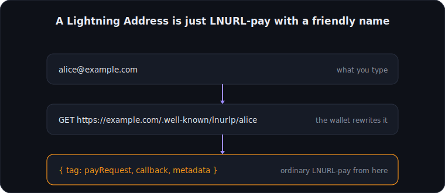

# Lightning Address

This is the feature normal users are most likely to have seen.

A Lightning Address looks like an email: `alice@example.com`. But it is only a convenient shell
around LNURL-pay:

1. When the wallet sees `alice@example.com`, it makes a `GET` to
   `https://example.com/.well-known/lnurlp/alice`.
2. The answer is exactly an LNURL-pay response (see [The four sub-protocols](./04-subprotocols.md)).
   From there everything continues identically.

That is all it is. No new protocol, no DNS trick, just a fixed convention for where the wallet asks.

<figure class="diagram">

<figcaption>A Lightning Address is just LNURL-pay with a friendly, dictatable name.</figcaption>
</figure>

This is why it lands so well: a forbidding bech32 blob turns into something you can read out over
the phone.

> The username part may only contain `a-z 0-9 - _ .` (stricter than email, lowercase only). The
> service must also put a `text/identifier` or `text/email` entry into the `metadata`.
